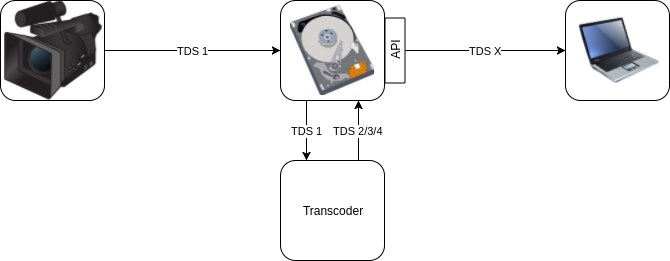

:warning: **This file is part of the "archive" &ndash; it could contain statements or terms which are incompatible with the main body of the specification and the identity and timing model.** :warning:

# 4. API Access

### Aim: Provide clients with access to related TDSs via an API

### Scenario

-   A camera captures video in a raw format and streams it onto the network
-   A storage device captures this network stream and stores the `TDS` to disk
-   A transcoder converts this raw `TDS` into a set of coded H.264 `TDS`s at different bitrates
-   The storage device exposes an API providing access to this content
-   An API client knows about `TDS` 1, but not about the alternative representations. It can only accept H.264 bitstreams

### Behaviour & Options

-   The client makes a request to the API for content related to `TDS` 1, but in a coded format it can interpret. It could work with any of `TDS` 2, 3 and 4, but needs to be able to request them in a common way.

**Content API**

1.  GET /TDSs/:id - Returns `Data Object`s for a single `TDS`
2.  GET /TDSs/?similarity_cluster=X - Returns a list of `TDS`s to choose from
3.  GET /similarity_cluster/:id - Returns `Data Object`s from any `TDS` which is part of this `Similarity Cluster`

For both (2) and (3), some notion of a `Similarity Cluster` is necessary in order to return `TDS`s which are alternative representations of the camera's output.

In (3), assuming some parameters are passed to the API indicating the formats which the client supports, it can supply `Data Object`s without the client having to know exactly what is held within the store.

**Content Segment Retrieval**

In order to retrieve specific portions of stored `TDS`s, `Time Value`s can be used to restrict the range of `Data Object`s returned by the API.

If `TDS`s have been stored using different `Time Context`s, it would be impossible to address them directly within a `Similarity Cluster` using the same `Time Value`s. As such, it is important that `Similarity Cluster`s restrict their contents to elements which use the same `Time Context`.

### Alternatives

-   Grouping of `TDS`s could be defined manually. This would limit their scope to within single devices, or a collection which shared the same grouping mechanisms. Manual association of similar `TDS`s would be more likely to result in errors.
-   `TDS`s could use different `Time Context`s within a `Similarity Cluster`. This would then move the complication of dealing with `Time Context` mapping to the API layer, making interactions more complex for the client.
